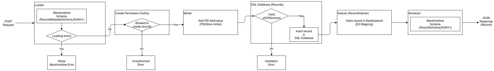
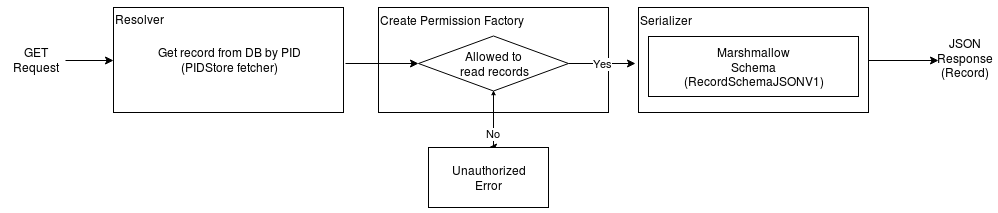

..
    This file is part of Invenio.
    Copyright (C) 2018 CERN.

    Invenio is free software; you can redistribute it and/or modify it
    under the terms of the MIT License; see LICENSE file for more details.

Understanding the REST API
==========================
In the :doc:`previous section <./understanding-datamodels>` , the different parts involved in a datamodel were explained. In this section we will show the process followed inside the RESTful API when creating and reading a record.

For example purposes, it will be assumed that you have an invenio app running with `Invenio-Records-REST <http://invenio-records-rest.readthedocs.io/en/latest/>`_ configured as follows (the rest is left as by default):

.. code-block:: python

    RECORDS_REST_ENDPOINTS = dict(
        docid=dict(
            list_route='/records/',
            item_route='/records/<pid(recid):pid_value>',
            record_serializers={
                'application/json': ('invenio_records_rest.serializers'
                                     ':json_v1_response'),
            },
            search_serializers={
                'application/json': ('invenio_records_rest.serializers'
                                     ':json_v1_search'),
            },
            record_loaders={
                'application/json': ('invenio_records_rest.loaders'
                                     ':json_pid_checker')
            }
        )
    )

In fact you can use the Invenio-Records-REST `example app <https://github.com/inveniosoftware/invenio-records-rest/tree/master/examples/>`_. You would just need to add to the configuration:

.. code-block:: python

    app.config['RECORDS_REST_ENDPOINTS']['recid']['record_loaders'] = {
        'application/json': ('invenio_records_rest.loaders'
                             ':json_pid_checker')
    }

Creating a record
-----------------

In the following flowchart, the process that a record goes through upon creation is shown:

`Note: If it is not displayed correctly click on it to be able to zoom in.`

The record is sent by performing a POST operation, which hits the API through the `records` endpoint(`RecordsListResource: POST <https://github.com/inveniosoftware/invenio-records-rest/blob/master/invenio_records_rest/views.py#L557>`_). For example:

.. code-block:: shell

    curl -k --header "Content-Type: application/json" \
        --request POST \
        --data '{"title":"Some title", "contributors": [{"name": "Doe, John"}]}' \
        https://localhost:5000/api/records/?prettyprint=1

We will now explain six steps, that correspond to the six big boxes of the previous diagram.

The first step is to load the record, which as its name implies, is performed by the **loader**. At the beginning of this section the `json_pid_checker` was configured as the `record_loader` for `application/json` requests, therefore, it is the one used in this case.

The record will be parsed by the `RecordMetadataSchemaJSONV1`. This schema only checks that the PID value is injected if needed (mostly for PUT operations). Nonetheless, you can create your own `Marshmallow` schema to fit your needs.

The next step is to check if the user has permissions to create records, by default all authenticated users are allowed. You can see more about access control in `TODO <Point to Access section>`.

Aftewards, the record is minted. This action again as it name implies, is carried out by the **minter**. It adds to the record the corresponding value to the attribute configured via `PIDSTORE_RECID_FIELD <https://github.com/inveniosoftware/invenio-pidstore/blob/master/invenio_pidstore/config.py#L11>`_. For example, increasing by one its value.

Subsequently, the record has to be persisted to the SQL database. However, before it is inserted, it is **validated**. Meaning, that the data will be cross-checked against the **JSONSchema**.

The next step, is to index it in Elasticsearch so the record can be searched. The record will be sent to the specified index (in the `$schema` field of the data) or the default if the attribute is not present. The validation of the data against the mapping is performed by Elasticsearch itself. In order to avoid errors and exceptions the JSONSchema should reflect the same data structure than the **ES mapping**.

So far, the record has been loaded (deserialized), minted, persisted and indexed. Therefore, it is only missing the las step: `serialization`. This operation is carried out by the **serializer**. In this case, the `json_v1_response <https://github.com/inveniosoftware/invenio-records-rest/blob/master/invenio_records_rest/serializers/__init__.py#L20>`_ is configured as serializer for responses. It will apply the corresponding `Marshmallow` schema and send the created record in the HTTP reponse with code 201.

Reading a record
----------------

In the following flowchart, the process that a record goes through upon creation is shown:

`Note: If it is not displayed correctly click on it to be able to zoom in.`

The process to read a record is a bit more simple than the that of cration explained above. In order to keep with the previous example, we would perform a GET operation:

.. code-block:: shell

    curl -k --header "Content-Type: application/json" \
        https://localhost:5000/api/records/1?prettyprint=1

This will hit the `item_route (/records/<pid(recid):pid_value>) <https://github.com/inveniosoftware/invenio-records-rest/blob/master/invenio_records_rest/views.py#L692>`_ of the REST API.

The next step is to obtain the record from the PID (`recid`) given in the URL. This is done by the **resolver**. Whose maps the given persistent identifier to an object in the database, and returns it.

Afterwards, it has to be checked if the user has permissions to read the requested record, by default all authenticated users are allowed. You can see more about access control in `TODO <Point to Access section>`.

Finally the record will be **serialized**. As before, the `json_v1_response <https://github.com/inveniosoftware/invenio-records-rest/blob/master/invenio_records_rest/serializers/__init__.py#L20>`_ is configured as serializer for responses. It will apply the corresponding `Marshmallow` schema and send the created record in the HTTP reponse with code 200.

Next steps
----------
Above is a quick walk through of the basic operations on the RESTful API. In
order to get more details on individual topics we suggest further reading:

- `Invenio-Records-REST <http://invenio-records-rest.readthedocs.io/en/latest/>`_
- `Invenio-JSONSchemas <http://invenio-jsonschemas.readthedocs.io/en/latest/>`_
- `Invenio-PIDStore <http://invenio-pidstore.readthedocs.io/en/latest/>`_
- `Invenio-Records <http://invenio-records.readthedocs.io/en/latest/>`_
- `JSONSchema <http://json-schema.org>`_
- `Elasticsearch mappings <https://www.elastic.co/guide/en/elasticsearch/reference/current/mapping.html>`_
- `Elasticsearch field types <https://www.elastic.co/guide/en/elasticsearch/reference/current/mapping-types.html>`_
- `Marshmallow schemas <https://marshmallow.readthedocs.io/en/3.0/index.html>`_
