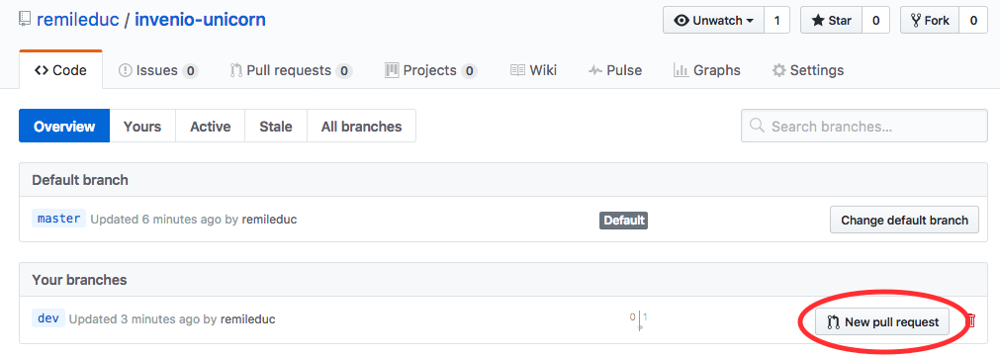

Part 4: Submit a pull-request
=============================

Now that we finished the development, we want to publish it on GitHub.

Push the code
-------------

To do so, we will first list our changes and add them to our local git repository:

.. code-block:: bash

    git status
    # shows all the files that have been modified
    git add .
    # adds all the modifications

Let's test our changes before we publish them. See :ref:`run-the-tests` for more information.

.. code-block:: bash

    ./run-tests.sh

It might complain about PEP8 formatting. Generally, it is because of a lack of new line at the end of your files. The error message will help you find how to fix it.

If it complains about the manifest, it is because we added new files, but we didn't register them into the ``MANIFEST.in`` file, so let's do so:

.. code-block:: bash

    check-manifest -u

Once all the tests are passing, we can push our code. As we were developing on a branch created locally, we need to push the branch on GitHub:

.. code-block:: bash

    git commit -am "basic development"
    git push --set-upstream origin dev

Create a Pull Request (PR)
--------------------------

We want that our changes get merged into the main branch (master) of the repository. So, let's go to the GitHub repository. From here, you can click on the *branch* button.

.. image:: resources/branch.png
    :align: center

Then, click on *New pull request*

Now, you can check the differences that you will add to the main branch. Fill a description and create the pull request.

