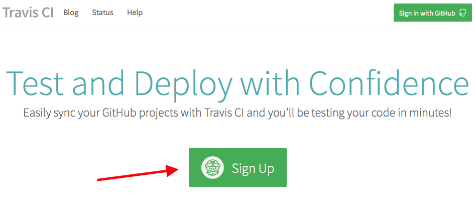
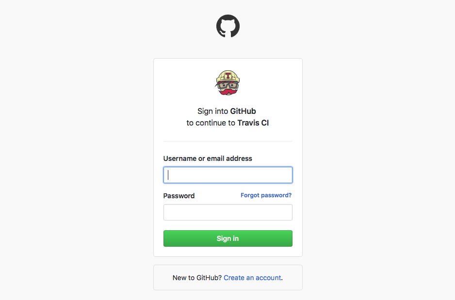
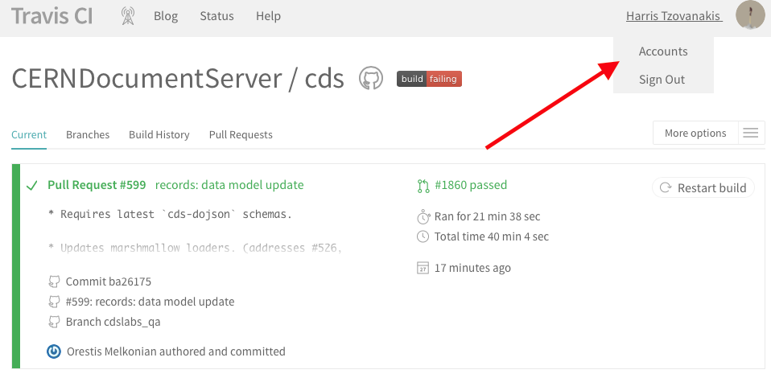

..
    This file is part of Invenio.
    Copyright (C) 2017-2018 CERN.

    Invenio is free software; you can redistribute it and/or modify it
    under the terms of the MIT License; see LICENSE file for more details.

Enable travis-cli and publish to GitHub
=======================================

Configure travis-cli.org
------------------------

1. Create an account
^^^^^^^^^^^^^^^^^^^^

We need first to create an account on `travis-cli.org <http://travis-cli.org>`_.

Add your github credentials to signup

2. Enable travis for your repo
^^^^^^^^^^^^^^^^^^^^^^^^^^^^^^

Go to your account

Click to enable the repo you have created

Done!

Create a Pull Request (PR)
--------------------------

We want that our changes get merged into the main branch (master) of the repository. So, let's go to the GitHub repository. From here, you can click on the *branch* button.

.. image:: resources/branch.png
    :align: center

Then, click on *New pull request*

.. image:: resources/pr.png
    :align: center

Now, you can check the differences that you will add to the main branch. Fill a description and create the pull request.
