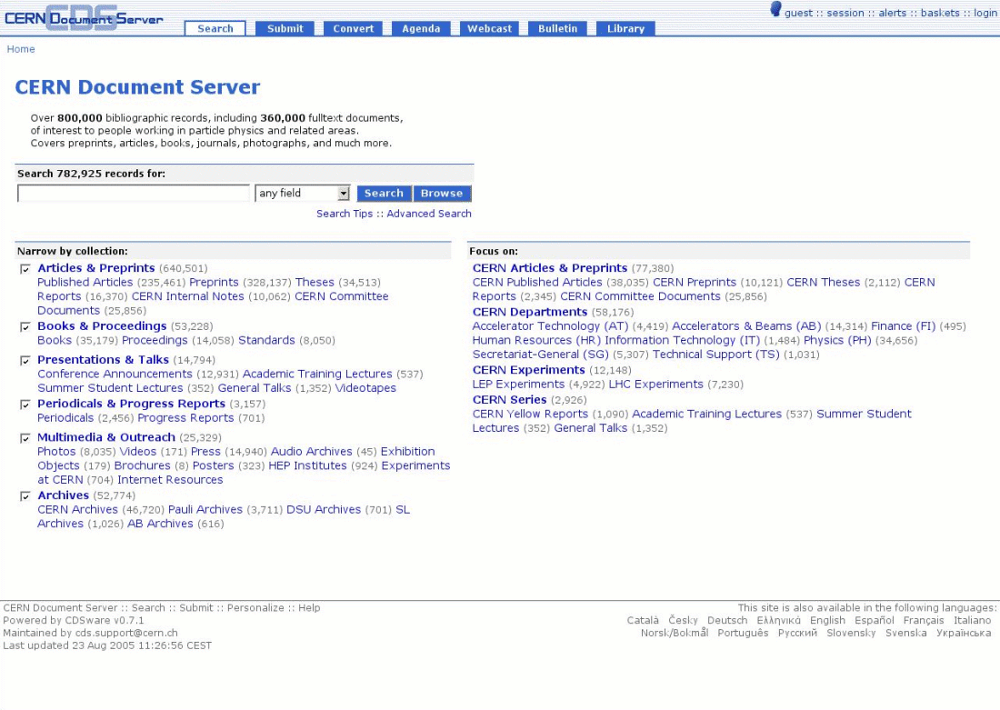
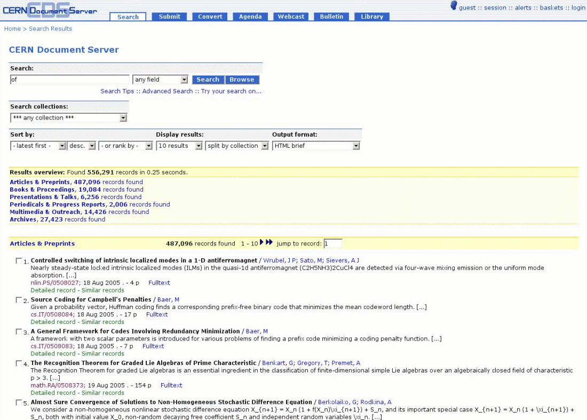
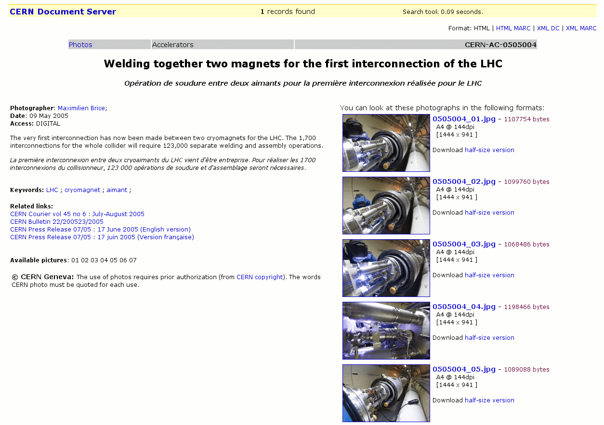
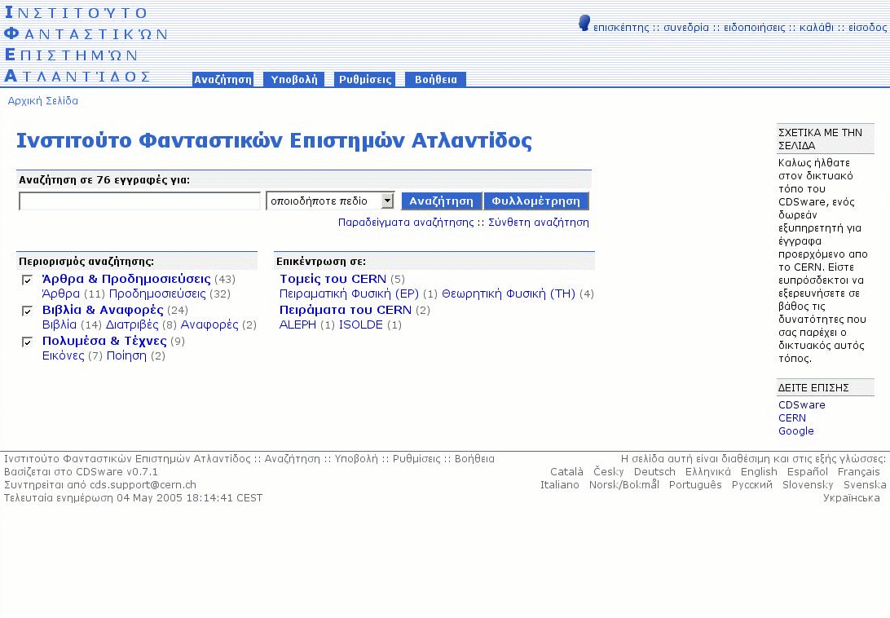
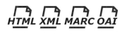

Features
========

Navigable collection tree
-------------------------

* Documents organised in collections
* Regular and virtual collection trees
* Customizable portalboxes for each collection
* At CERN, over 1,000,000 documents in 700 collections

Powerful search engine
----------------------

* Specially designed indexes to provide fast search speed for repositories of up to 2,000,000 records
* Customizable simple and advanced search interfaces
* Combined metadata, fulltext and citation search in one go
* Results clustering by collection

Flexible metadata
-----------------

* Standard metadata format (MARC)
* Handling articles, books, theses, photos, videos, museum objects and more
* Customizable display and linking rules

User personalization
--------------------

* user-defined document baskets
* user-defined automated email notification alerts
* basket-sharing within user groups
* Amazon-like user comments for documents in repository and shared baskets

Multiple output formats
-----------------------

To find out more about Invenio's features, please check the general :ref:`documentation` page.
