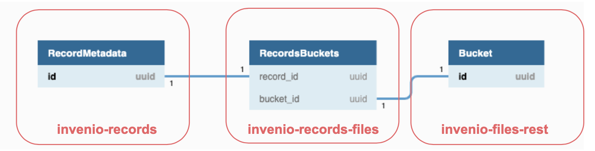

..
    This file is part of Invenio.
    Copyright (C) 2019 CERN.

    Invenio is free software; you can redistribute it and/or modify it
    under the terms of the MIT License; see LICENSE file for more details.

.. _integration:

Integrating Files
=================

Invenio provides a bundle of modules to accommodate all around needs about
file management:

- :code:`invenio-files-rest`
- :code:`invenio-records-files`
- :code:`invenio-previewer`
- :code:`invenio-iiif`

Integration overview
++++++++++++++++++++

.. note:: If you want to use records with files, please note that you should be
  using the `Record class <https://invenio-records-files.readthedocs.io/en/latest/api.html#invenio_records_files.api.Record>`_
  provided in :code:`invenio-records-files`

Once your invenio instance is populated with records, you might want to add
files to it. The :code:`invenio-records-files` package is combining together
the :code:`invenio-records` module and the :code:`invenio-files-rest` module
and provides APIs to simplify the files integration.

The main classes involved in this process are :

- `RecordMetadata <https://invenio-records.readthedocs.io/en/latest/api.html#invenio_records.models.RecordMetadata>`_
  : contains metadata of the record.
- `Bucket <https://invenio-files-rest.readthedocs.io/en/latest/api.html#invenio_files_rest.models.Bucket>`_
  : contains files.
- `RecordsBucket <https://invenio-records-files.readthedocs.io/en/latest/api.html#invenio_records_files.models.RecordsBuckets>`_
  : associates a record with one or more files contained in a bucket.

The following schema gives an overview of this integration and it's followed by a small description of the two file
modules involved.

`invenio-files-rest <https://invenio-files-rest.readthedocs.io/>`_
~~~~~~~~~~~~~~~~~~~~~~~~~~~~~~~~~~~~~~~~~~~~~~~~~~~~~~~~~~~~~~~~~~
:code:`invenio-files-rest` is the first required module for managing files
with your application, and some of its key functions is to allow you to store
and retrieve files in a similar way to Amazon S3 APIs.

- Configurable files storage
- Secure REST APIs for upload/download
- Support for large file uploads and multipart upload.
- File integrity monitoring
- Customizable access control

`invenio-records-files <https://invenio-records-files.readthedocs.io/>`_
~~~~~~~~~~~~~~~~~~~~~~~~~~~~~~~~~~~~~~~~~~~~~~~~~~~~~~~~~~~~~~~~~~~~~~~~

:code:`invenio-records-files` is the other required module, which provides a
basic API for the seamless co-operation of `invenio-records <https://invenio-records.readthedocs.io/>`__
and `invenio-files-rest`_. The API provides functionality for

- records creation
- files creation
- accessing files
- files metadata management
- files extraction from records

File previewing
+++++++++++++++

After your files have been integrated, invenio provides packages that allow
the previewing of them.

`invenio-previewer <https://invenio-previewer.readthedocs.io/>`_
~~~~~~~~~~~~~~~~~~~~~~~~~~~~~~~~~~~~~~~~~~~~~~~~~~~~~~~~~~~~~~~~

:code:`invenio-previewer` by default comes with support to a number of file
types but it also provides an extensible API to create new previewers.
By default the supported file types are: **PDF**,
**ZIP** **CSV**, **Markdown**, **XML**, **Json**, **PNG**, **JPG**, **GIF** and
**Jupyter Notebooks**.

`invenio-iiif <https://invenio-iiif.readthedocs.io/>`_
~~~~~~~~~~~~~~~~~~~~~~~~~~~~~~~~~~~~~~~~~~~~~~~~~~~~~~

:code:`invenio-iiif` integrates Invenio-Records-Files with `Flask-IIIF <https://flask-iiif.readthedocs.io/en/latest/>`__
to provide support for serving images complying with the International Image
Interoperability Framework (IIIF) API standards.

Invenio-IIIF registers the REST API endpoint provided by Flask-IIIF in the
Invenio instance through entry points. On each image request, it delegates
authorization check and file retrieval to Invenio-Files-REST and it serves the
image after adaptation by Flask-IIIF. Invenio-IIIF can also be used in a
combination with Invenio-Previewer to preview images and comes with the
following features.

- Thumbnail generation and previewing of images.
- Allows to preview, resize and zoom images, by implementing the `IIIF <https://iiif.io/>`__ API.
- Provide celery task to create image thumbnails.
