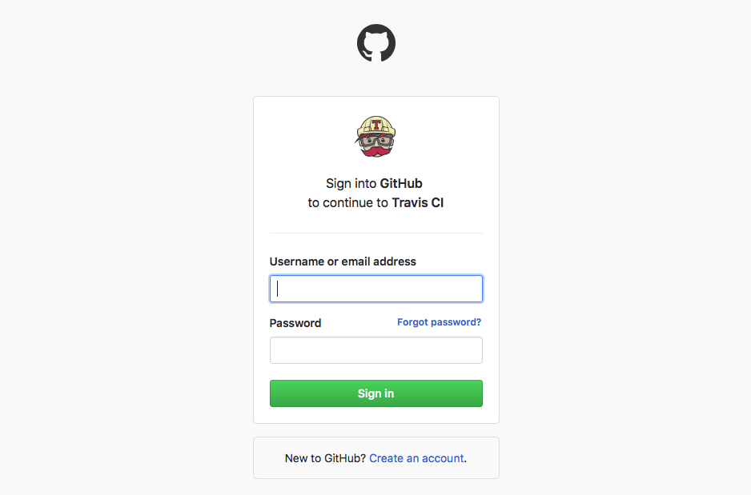

..
    This file is part of Invenio.
    Copyright (C) 2017-2018 CERN.

    Invenio is free software; you can redistribute it and/or modify it
    under the terms of the MIT License; see LICENSE file for more details.

Continue integration with TravisCI
==================================
This section will show you how to enable continue integration using the
TravisCI service. Note, that you code must have been published on GitHub in
order for this to work.

TravisCI allows to run the tests of your module in a test matrix with different
Python versions, and different versions of dependent Python packages. This
ensures that your module becomes more robust.

Configure travis-ci.org
------------------------

1. Create an account
^^^^^^^^^^^^^^^^^^^^
We need first to create an account on `travis-ci.org <http://travis-ci.org>`_.

.. image:: resources/travis-signup.png
    :align: center

Add your github credentials to signup

2. Enable travis for your repo
^^^^^^^^^^^^^^^^^^^^^^^^^^^^^^
Go to your account

.. image:: resources/travis-account.png
    :align: center

Click to enable the repo you have created

.. image:: resources/travis-click-to-enable.png
    :align: center

Done!

Create a Pull Request (PR)
--------------------------
We want that our changes get merged into the main branch (master) of the
repository. So, let's go to the GitHub repository. From here, you can click on
the *branch* button.

.. image:: resources/branch.png
    :align: center

Then, click on *New pull request*

.. image:: resources/pr.png
    :align: center

Now, you can check the differences that you will add to the main branch. Fill
a description and create the pull request.

If TravisCI was correctly enabled, the pull request will now display a status
check, that TravisCI is running the tests. If the tests pass, the status check
will become green, if the tests fails it will become red. This way you're
always sure not to integrated code that breaks your tests.
